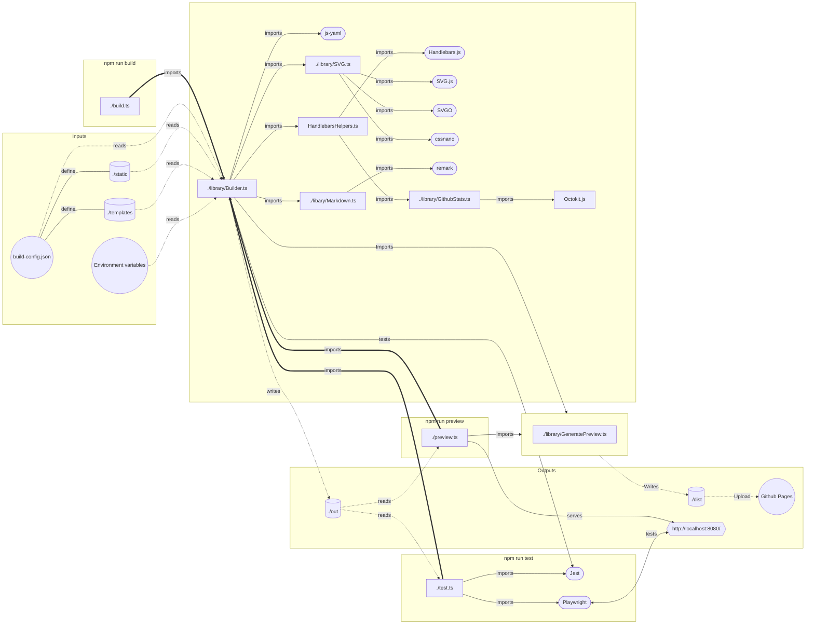

<h1 align="center"><strong><em>Dylan Langston's Github profile</em> 🙋‍♂️</strong></h1>
<p align="center">
    <picture width="100%" alt="Dylan Langston's Github profile 🙋‍♂️" align="center">
      <source media="(prefers-color-scheme: dark)" srcset="../dylan-dark.svg">
      
    </picture>
</p>

<p align="center">
  <a href="https://www.typescriptlang.org/"></a>
  <a href="https://github.com/dylanlangston/dylanlangston/actions/workflows/build.yml"></a>
  <a href="https://github.com/dylanlangston/dylanlangston/blob/master/LICENSE"></a>
  <a href="https://api.github.com/repos/dylanlangston/dylanlangston"></a>
</p>

### A brief introduction 🎤
Hello and welcome! This repository contains the source code used to generate my Github profile readme. The core of this solution lies in using the combination of YAML and Handlebars as templates. The [`./build.ts`](./build.ts) file orchestrates the build process, utilizing [`./library/Builder.ts`](./library/Builder.ts) to generate assets based on templates like [`./templates/dylan.svg.hbs.yaml`](./templates/dylan.svg.hbs.yaml) and [`./templates/readme.md.hbs`](./templates/readme.md.hbs) defined in [`./build-config.json`](./build-config.json). These templates are processed using Handlebars, allowing for population of variables also defined in `./build-config.json`. The novel approach of SVG with YAML markup enhances readability and enables post-processing techniques to optimize the final SVG output.

### Building 🏗️

<table>
  <tr>
    <td>

__Getting the Source Code__
1. Clone the repository: 
    ```
    git clone https://github.com/dylanlangston/dylanlangston.git
    ```
2. Navigate to the project's source directory:
    ```
    cd dylanlangston/src
    ```

    </td>
  </tr>
  <tr></tr>
  <tr>
    <td>

__Installing Dependencies__
* Install npm packages:
   ```
   npm install
   ```

    </td>
  </tr>
  <tr></tr>
  <tr>
    <td>

__Building__

* To build, run the following command:
    ```
    npm run build
    ```

    </td>
  </tr>
  <tr></tr>
  <tr>
    <td>

__Test__
* To test, run the following command:
    ```
    npm run test
    ```

    </td>
  </tr>
  <tr></tr>
  <tr>
    <td>

__Preview__
1. To preview, run the following command:
    ```
    npm run preview
    ```
2. Open [http://localhost:8080/](http://localhost:8080/)

    </td>
  </tr>
</table>

### Dev Environment 💻
<table>
  <tr>
    <td colspan="6">
      This repository offers a streamlined development environment setup using a <a href="../.devcontainer/devcontainer.json"><code>devcontainer.json</code></a> file, allowing you to get up and running quickly with a fully-featured environment in the cloud.<sup><a href="#local-development" id="fnref-local-development">[1]</a></sup> Use one of the following links to get started:
    </td>
  </tr>
  <tr>
    <td colspan="2">
      <p align="center">
        <a href="https://codespaces.new/dylanlangston/dylanlangston"></a>
      </p>
    </td>
    <td colspan="2">
      <p align="center">
        <a href="https://vscode.dev/redirect?url=vscode://ms-vscode-remote.remote-containers/cloneInVolume?url=https://github.com/dylanlangston/dylanlangston"></a>
      </p>
    </td>
    <td colspan="2">
      <p align="center">
        <a href="https://devpod.sh/open#https://github.com/dylanlangston/dylanlangston"></a>
      </p>
    </td>
  </tr>
  <tr>
    <td colspan="6">
      If you want to browse the source code without the need to build, you can do so conveniently on GitHub.dev or VSCode.dev:
    </td>
  </tr>
  <tr>
    <td colspan="3">
      <p align="center">
        <a href="https://github.dev/dylanlangston/dylanlangston"></a>
      </p>
    </td>
    <td colspan="3">
      <p align="center">
        <a href="https://vscode.dev/github/dylanlangston/dylanlangston"></a>
      </p>
    </td>
  </tr>
</table>
</p>

### Solution Architecture 🏰


### Citations 📓
In this project, we utilize images under fair use to create derivative artwork. These images are sourced from publicly available resources and are used for the purpose of creating transformative artworks.
<table>
  <tr>
    <td></td>
    <td>
      <p><em>Bliss (Windows XP)</em></p>
      <p>Original scan of Charles O'Rear's photograph</p>
      <p>Source: <a href="https://en.wikipedia.org/wiki/File:Bliss_(Windows_XP).png">Wikipedia</a></p>
      <p>License: Used with permission from Microsoft</p>
    </td>
  </tr>
  <tr>
    <td></td>
    <td>
      <p><em>Solo Jazz design</em></p>
      <p>The Solo Jazz design by Gina Ekiss represented in a high-quality clean image.</p>
      <p>Source: <a href="https://en.wikipedia.org/wiki/File:Solo_Jazz_design.jpg">Wikipedia</a></p>
      <p>License: Solo Cup Company/Dart Container</p>
    </td>
  </tr>
</table>

### Special Thanks 🙏
Shout out to [Andrew6rant](https://github.com/Andrew6rant/Andrew6rant)'s fantastic github profile for inspiration and the css used for the [`templates/stats.svg.hbs.yaml`](templates/stats.svg.hbs.yaml).

### External Resources ℹ️
Here are some additional resources which are used:
<table>
  <tr>
    <td><a href="https://github.com/cssnano/cssnano">cssnano</a> - Used to optimize CSS</td>
  </tr>
  <tr>
    <td><a href="https://github.com/handlebars-lang/handlebars.js">Handlebars.js</a> - Used to Populate Templates</td>
  </tr>
  <tr>
    <td><a href="https://github.com/nodeca/js-yaml">js-yaml</a> - Used to read YAML templates</td>
  </tr>
  <tr>
    <td><a href="https://github.com/jestjs/jest">Jest</a> - Unit testing</td>
  </tr>
  <tr>
    <td><a href="https://github.com/octokit/octokit.js">Octokit.js</a> - Used to retrieve Github Stats</td>
  </tr>
  <tr>
    <td><a href="https://github.com/microsoft/playwright">Playwright</a> - Integration testing</td>
  </tr>
  <tr>
    <td><a href="https://github.com/remarkjs/remark">remark</a> - Used to generate and optmize Markdown</td>
  </tr>
  <tr>
    <td><a href="https://github.com/svgdotjs/svg.js">SVG.js</a> - Used to generate SVGs</td>
  </tr>
  <tr>
    <td><a href="https://github.com/svg/svgo">SVGO</a> - Used to optimize SVGs</td>
  </tr>
</table>

### License 📜
This repository is licensed under the [MIT License](https://opensource.org/licenses/MIT). See the [`LICENSE`](https://github.com/dylanlangston/dylanlangston/blob/main/LICENSE) file for details.

<h2 id="footer"></h2>
<sub>
<section>
  <ol dir="auto">
    <li id="local-development">
    <p>For local development check out <a href="https://marketplace.visualstudio.com/items?itemName=ms-vscode-remote.remote-containers">Dev Containers</a> and <a href="https://devpod.sh/">DevPod</a>. <a href="#fnref-local-development" aria-label="Back to reference 1">↩</a></p>
    </li>
  </ol>
</section>
</sub>
